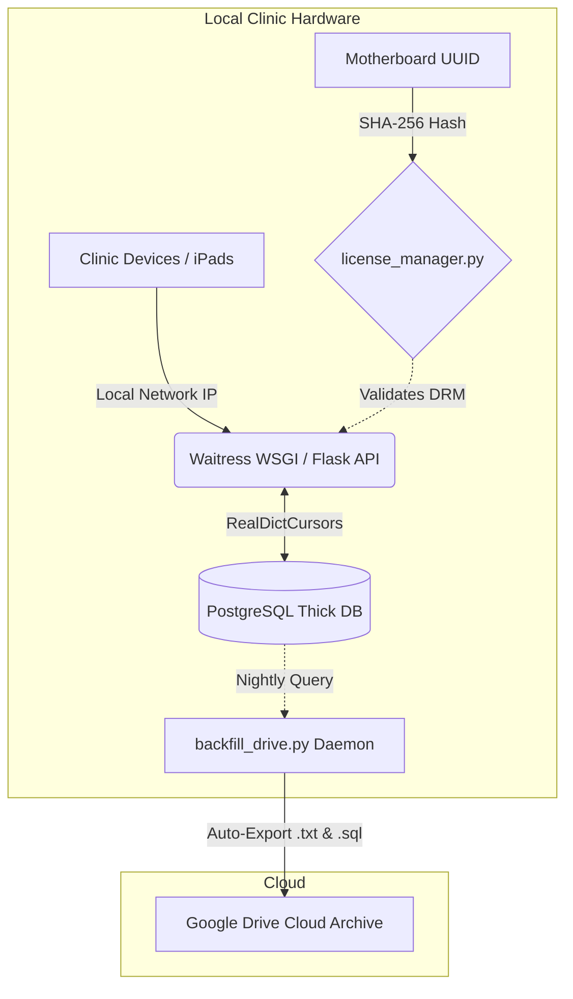
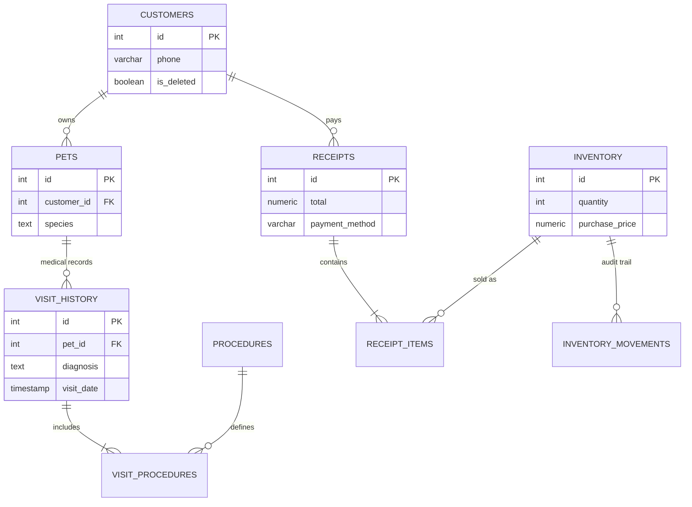

# MercyVet: Offline-First Veterinary ERP & Clinic Management System

**[ 🔗 Watch the 3-Minute Architectural Video Demonstration Here ](https://www.youtube.com/watch?v=trs6_DmjT2Q)**

**[ 🔗 Watch the Clinic Director's Endorsement & Case Study Here ](Testimonial Goes here)**

## 📌 Executive Summary

MercyVet is a proprietary, offline-first Enterprise Resource Planning (ERP) and Shop Management System (SMS) engineered specifically for high-volume veterinary clinics. Built to operate in environments with unstable internet connectivity, the system digitizes patient records, automates point-of-sale (POS) financials, manages clinical procedures, and enforces strict Role-Based Access Control (RBAC).

To support a B2B SaaS subscription model ($100/mo), the application is compiled as a standalone executable. It is hosted on the clinic's local machine and broadcasted across the internal router to allow multi-device access (e.g., receptionists and doctors), secured by a custom cryptographic DRM engine that locks the software to the host's physical hardware.

## 📊 System Impact & Metrics

* **Production Scale:** Currently managing an active PostgreSQL database of 300+ patients, 700+ physical inventory items, 40+ clinical procedures, and processing 500+ receipts.
* **100% Uptime:** Successfully deployed on local hardware with zero downtime over four months of continuous clinical use.
* **Cross-Device Compatibility:** Designed with a responsive UI (CSRF-protected) that functions flawlessly across desktops, iPads, and mobile devices connected to the clinic's local network.

## 🛠️ Tech Stack & Architecture

* **Backend:** Python (Flask, Waitress WSGI)
* **Database:** PostgreSQL (Thick Database Architecture)
* **Frontend:** Server-Side Rendered HTML5/CSS3, Responsive UI
* **Deployment:** PyInstaller (Compiled Standalone Binary), Local Network IP Broadcasting
* **Cloud Integration:** Automated Google Drive Disaster Recovery Daemon

---

## ⚙️ Core Engineering Achievements

### 1. Cryptographic DRM & Hardware Locking (`license_manager.py` & `keygen.py`)

To protect intellectual property and enforce a SaaS subscription model entirely offline, I engineered a custom Digital Rights Management (DRM) solution:

* **Hardware Fingerprinting:** The system queries the host machine's WMIC (Windows Management Instrumentation) to extract the unique Motherboard UUID.
* **SHA-256 Verification:** The Motherboard UUID is concatenated with the subscription expiration date and a private cryptographic salt, then hashed via SHA-256.
* **Proactive Expiry Alerts:** The system tracks the license expiration date. 7 days prior to expiry, a persistent red banner injects into the UI to warn the clinic to contact support, preventing sudden lockouts.
* **B2B KeyGen Portal:** Built a separate local portal to generate Base64-encoded machine tokens for 1-month, 3-month, 6-month, and 12-month billing cycles.

### 2. "Thick Database" & Automated Financials (`mercyvet.sql`)

The PostgreSQL schema handles heavy business logic, keeping the Python API thin and exceptionally fast:

* **Automated Checkout Pipeline:** When a clinician finalizes a medical visit, the procedures are automatically pushed to the POS "Waiting List" as a prepared receipt, eliminating double-entry.
* **Net Profit Aggregation:** The system calculates real-time daily financials by dynamically subtracting procedure/product base costs, flat IQD discounts, and logged clinic expenses (e.g., utility bills) from the total gross revenue.
* **Supplier Debt Tracking:** Engineered a dual-currency (IQD and USD) supplier ledger that tracks total owed vs. upfront payments, updating the remaining clinic debt in real-time.

### 3. Dynamic Role-Based Access Control (`middleware.py`)

Built a highly secure middleware layer to protect sensitive financial data from unauthorized staff:

* **Dynamic Role Creation:** Admins can create custom roles (e.g., "Receptionist") by checking specific UI boxes for the modules they are allowed to see.
* **Session-Based RBAC:** Permissions are loaded into the secure session cookie upon login. The middleware dynamically restricts the UI. A Receptionist only sees Customers, Pets, and Appointments, while the Dashboard's System Administration controls and Daily Financials are completely sanitized from their view.

### 4. Automated Disaster Recovery & Cloud Sync (`backfill_drive.py`)

Because the clinic operates offline-first, data loss from hardware failure was a critical risk.

* **Runtime Sync Daemon:** Engineered a Python daemon that runs automatically at 9:00 PM during clinic hours.
* **Automated Data Structuring:** The script queries the database and dynamically generates structured Google Drive folders (e.g., `Records/PetName_Species_OwnerName_PetID`).
* **Text-Based Mirroring:** It generates clean, standardized `.txt` medical reports (including weights, diagnoses, and treatments) and mirrors them to the drive, alongside patient profile pictures and `pg_dump` database snapshots.
* **UI "Time Machine":** Built a System Administration panel on the Admin Dashboard that logs the last 5 automated/manual database snapshots, allowing 1-click database restoration with strict overwrite confirmations.

### 5. Clinical Workflow Optimization

Designed specific algorithms to solve real-world clinic bottlenecks:

* **Timeline Scheduling:** Engineered a visual appointment timeline that maps out 30-minute block indicators to visually prevent receptionists from double-booking slots.
* **Phone Queue Logic:** Built a 7-day, 3-day, and 1-day appointment reminder queue that requires clinicians to click "Done" to confirm they have called the client.
* **Inventory Expiration Tracking:** Built an automated inventory sorting matrix that categorizes physical medical stock into 90, 60, 30, and EXPIRED day thresholds, allowing the clinic to run promotional discounts on soon-to-expire products.
