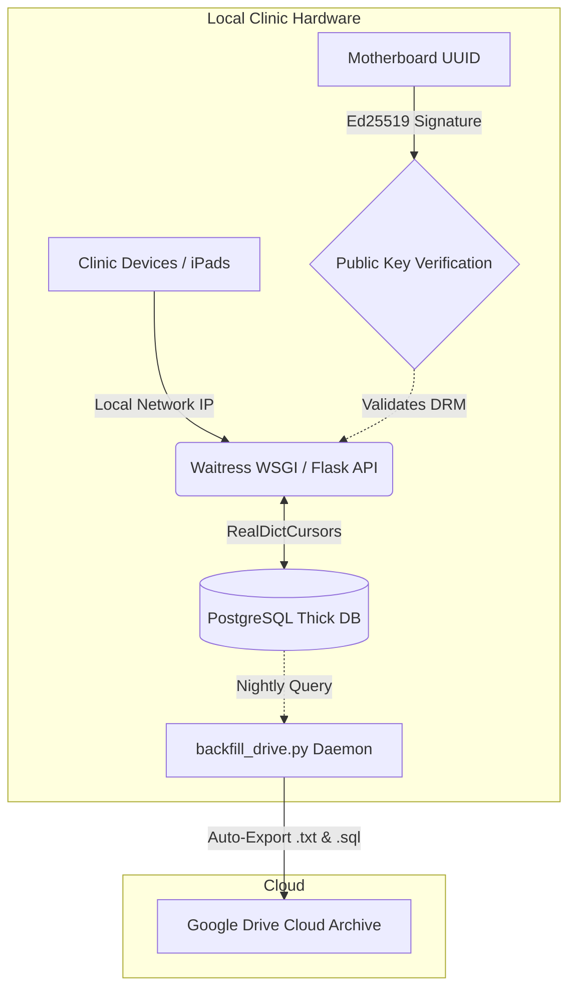
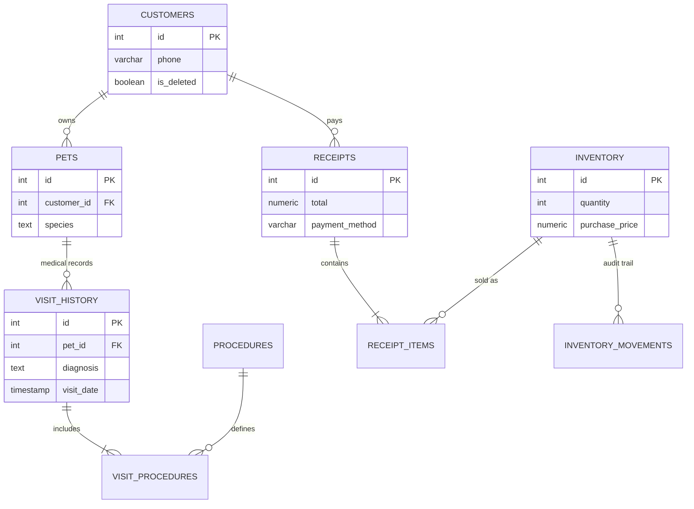

# MercyVet: Offline-First Veterinary ERP & Clinic Management System

**[ 🔗 Watch the 3-Minute Architectural Video Demonstration Here ](https://www.youtube.com/watch?v=trs6_DmjT2Q)**

**[ 🔗 Watch the Clinic Director's Endorsement ](https://youtube.com/shorts/YXOO-PCw0xQ?feature=share)**

## 📌 Executive Summary
MercyVet is a proprietary, offline-first Enterprise Resource Planning (ERP) and Shop Management System (SMS) engineered specifically for high-volume veterinary clinics. Built to operate in environments with unstable internet connectivity, the system digitizes patient records, automates point-of-sale (POS) financials, manages clinical procedures, and enforces strict Role-Based Access Control (RBAC).
To support a B2B SaaS subscription model entirely offline, the application is compiled as a standalone executable. It hosts a local Waitress WSGI server dynamically broadcasted across the clinic's router via mDNS, allowing instant multi-device access (e.g., iPads, phones) securely locked down by an Asymmetric Cryptographic DRM engine.

## 📊 System Impact & Metrics

* **Production Scale:** Actively managing a PostgreSQL database of 300+ patients, 700+ physical inventory items, 40+ clinical procedures, and 500+ processed receipts.
* **100% Uptime:** Deployed on local hardware with zero bugs and zero downtime over four months of continuous, rigorous clinical use.
**Cross-Device Compatibility:** Engineered with zeroconf Multicast DNS (mDNS). The server broadcasts as mercyvet.local, allowing veterinary staff to instantly access the CSRF-protected responsive UI via iPads without static IP configurations.

## 🛠️ Tech Stack & Architecture

* **Backend:** Python (Flask, Waitress WSGI, Threading)
* **Database:** PostgreSQL (Thick Database Architecture, Auto-Bootstrapping)
* **Frontend:** Server-Side Rendered HTML5/CSS3, Responsive UI
* **Security:** cryptography (Ed25519 Asymmetric PEM Keys), CSRF Protection, Argon2/PBKDF2 Password Hashing
* **Deployment:** PyInstaller (Compiled Standalone Binary), InnoSetup
* **Cloud Integration:** Automated Google Drive Disaster Recovery Daemon

---

## ⚙️ Core Engineering Achievements

### 1. Asymmetric Cryptographic DRM & Hardware Locking

To protect intellectual property and enforce a SaaS subscription model offline, I engineered a military-grade Digital Rights Management (DRM) solution:
* **Hardware Fingerprinting:** Queries the host machine's WMIC to extract the unique Motherboard UUID.
* **Ed25519 Asymmetric Signatures:** The subscription expiration payload is signed privately via my master private_key.pem. The client software only contains a public_key.pem to mathematically verify the signature's authenticity, making forged licenses impossible.
* **Proactive Expiry Alerts:** Tracks license duration and injects persistent UI warnings 7 days prior to expiry, culminating in a frictionless "Smart Code" renewal portal.
### 2. Autonomous Database Bootstrapping & "Thick DB" SQL

The PostgreSQL schema handles heavy business logic, keeping the Python API exceptionally fast:
* **Zero-Touch Installation:** The Python binary detects if the regional PostgreSQL instance lacks the mercyvet database. If missing, it autonomously connects, builds the database, injects 20+ relational tables, sequences, PL/pgSQL triggers, and bootstraps the default Admin user.
* **Automated Checkout Pipeline:** When a clinician finalizes a medical visit, the procedures are automatically pushed to the POS "Waiting List" as a prepared receipt, eliminating double-entry.
* **Immutable Financials:** Calculates real-time daily profit by dynamically tracking historic COGS (Cost of Goods Sold), IQD/USD currency discounts, and logged overhead expenses.

### 3. Dynamic Role-Based Access Control (Middleware)

Built a highly secure middleware layer to protect sensitive financial data from unauthorized staff:

* **Session-Based RBAC:** Permissions load into secure, HTTP-only session cookies. The middleware dynamically sanitizes the UI—Receptionists only route patients, while System Administration and Financial ledgers are completely hidden from the DOM and blocked at the API layer.

### 4. Automated Disaster Recovery & Cloud Sync 

To mitigate local hardware failure risks:

* **Runtime Sync Daemon:** A background Python thread triggers automatically at 9:00 PM.
* **ETL Data Structuring:** Queries the database to dynamically generate structured Google Drive hierarchies (e.g., Records/PetName_Species_OwnerID).
* **Text-Based Mirroring:** Generates standardized .txt medical reports and mirrors them to the cloud alongside pg_dump binary backups and image attachments.
*  **UI "Time Machine":** A 1-click database restoration panel in the Admin Dashboard logs the last 5 snapshots for immediate rollback.

### 5. Clinical Workflow Optimization

Designed specific algorithms to solve real-world clinic bottlenecks:

* **Timeline Scheduling:** Engineered a visual appointment timeline that maps out 30-minute block indicators to visually prevent receptionists from double-booking slots.
* **Phone Queue Logic:** Built a 7-day, 3-day, and 1-day appointment reminder queue that requires clinicians to click "Done" to confirm they have called the client.
* **Inventory Expiration Tracking:** Built an automated inventory sorting matrix that categorizes physical medical stock into 90, 60, 30, and EXPIRED day thresholds, allowing the clinic to run promotional discounts on soon-to-expire products.
